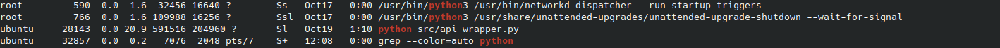

## Instructions to setup Flask code on AWS


- Login to AWS

- Select the EC2 instance

- Select `Ubuntu` machine

- Create a key-pair secret-key for ssh connection from our machine to the cloud machine and download the `.pem` file with s name say `AWSUbuntu`

- Launch the instance

- Once its done and passes 2/2 checks select the instance by clicking on the square box

- Copy the Public IP from the details

- Open your local machine terminal and jump to the folder where the key-pair file is downloaded (`.pem` file)

- Give required permission by executing the following command

```bash
sudo chmod 400 AWSUbuntu.pem
```

- Run the following command to setup the ssh connection

```bash
ssh -i AWSUbuntu.pem ubuntu@<public_IP_address>
```

- Open github and right click on `Download ZIP` and select `Copy Link Address`

- Install `unzip` package

```bash
sudo apt install unzip
```

- Clone the zip file for the Github repository

```bash
wget <copied_link_address_of_github>
```

- Unzip the file

```bash
unzip master.zip
```

- Change the directory

```bash
cd <nane_of_the_github_repo>
```

- Installations

```bash
sudo apt install python
```

```bash
sudo apt install python3.12-venv
```

- Initiate a virtual environment and activate it

```bash
python3 -m venv venv
```

```bash
source venv/bin/activate
```

- Install the requirements

```bash
pip install -r requirements.txt
```

- Run the project
```bash
python run main.py
```

- It should show something like this ` * Running on http://127.0.0.1:5000`

- Test it by open another terminal and conenecting via ssh to the cloud machine and run the following command

```bash
curl http://127.0.0.0:5000
```

- If there is a GET API for this it will show the response

- Now the challenge is to have it on public IP

- First of all make sure to have allowed hosts on the flask code 

```bash
if __name__ == "__main__":
    app.run(host="0.0.0.0", port=5000)
```

- Now we have to setup `nginx`

- Install `nginx`

```bash
sudo apt install nginx
```

- Go to the following directory

```bash
/etc/nginx/sites-enabled
```

- Create a file with the name of the Public ID make sure to write IP address inside double quotes suppose IP address is `2.45.132.230` so run the following
```bash
sudo nano "2.45.132.230"
```


- Paste the following code, make sure to change the IP address

```bash
server {
    listen 80;
    listen [::]:80;
    server_name <YOUR INSTANCE IP>;
        
    location / {
        proxy_pass http://127.0.0.1:5000;
        include proxy_params;
    }
}
```

- Run the following command

```bash
sudo systemctl restart nginx
```


```bash
sudo systemctl status nginx
```

- We will get a response like this


- Now use the IP address (no need to add the PORT) and hit the API to get the response


### To run the python server in background even after killing the terminal use `nohup`

    ```bash
    nohup python app.py
    ```


### To kill a `nohup python server`


- Run the following command

```bash
ps aux | grep python
```

- We wwill get a list something like this


In this we have to kill the one with `P ID` as `28143` as it is running the python server


- Run the following command to kill the terminal

```bash
kill <P_ID>
```


### To convert `http` requests into `https` requests


- Install Certbot and OpenSSL

```bash
sudo apt update
sudo apt install certbot python3-certbot-nginx openssl
```


- Generate a Self-Signed SSL Certificate

```bash
sudo openssl req -x509 -nodes -days 365 -newkey rsa:2048 -keyout /etc/ssl/private/selfsigned.key -out /etc/ssl/certs/selfsigned.crt
```

- Create a Diffie-Hellman Group

```bash
sudo openssl dhparam -out /etc/ssl/certs/dhparam.pem 2048
```


- Configure NGINX for HTTPS

    - Open the NGINX config file:

    ```bash
    sudo nano /etc/nginx/sites-available/default
    ```

    - Add the following configuration:

    ```bash
    server {
    listen 80;
    listen [::]:80;
    server_name _;

    return 301 https://$host$request_uri;
    }

    server {
        listen 443 ssl;
        listen [::]:443 ssl;
        server_name _;

        ssl_certificate /etc/ssl/certs/selfsigned.crt;
        ssl_certificate_key /etc/ssl/private/selfsigned.key;
        ssl_dhparam /etc/ssl/certs/dhparam.pem;

        ssl_protocols TLSv1.2 TLSv1.3;
        ssl_prefer_server_ciphers on;
        ssl_ciphers "ECDHE-ECDSA-AES256-GCM-SHA384:ECDHE-RSA-AES256-GCM-SHA384";

        location / {
            proxy_pass http://127.0.0.1:5000;
            proxy_set_header Host $host;
            proxy_set_header X-Real-IP $remote_addr;
            proxy_set_header X-Forwarded-For $proxy_add_x_forwarded_for;
            proxy_set_header X-Forwarded-Proto $scheme;
        }
    }
    ```

- Test Your NGINX Configuration

```bash
sudo nginx -t
```

- Reload NGINX

```bash
sudo systemctl reload nginx
```

### Continuous server running even after closing terminal using `pm2` for `Nodejs`

- Install `pm2`

```bash
sudo npm install -g pm2
```

- Navigate to your project folder and start the application using `pm2`, make sure to change the name from `my-app` to project name

```bash
pm2 start npm --name "my-app" -- run dev
```

- Ensure pm2 Restarts on Reboot

```bash
pm2 startup
```

- This will output a command that you need to copy and run to configure the startup script something like this `sudo env PATH=$PATH:/usr/bin /usr/local/lib/node_modules/pm2/bin/pm2 startup systemd -u ubuntu --hp /home/ubuntu`. Run this command

- After running that command, save the current process list with:

```bash
pm2 save
```

- Check the status of all running apps

```bash
pm2 list
```

- Stop an app:

```bash
pm2 stop `my-app`
```


- To check status of node server

```bash
pm2 logs firstbench-ai-node
```


